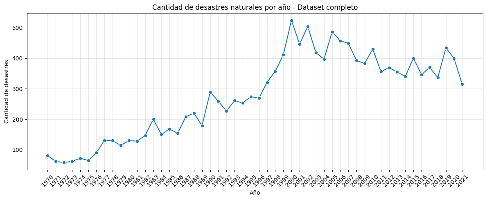
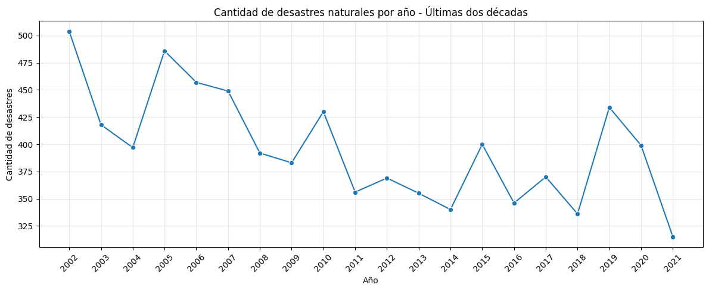
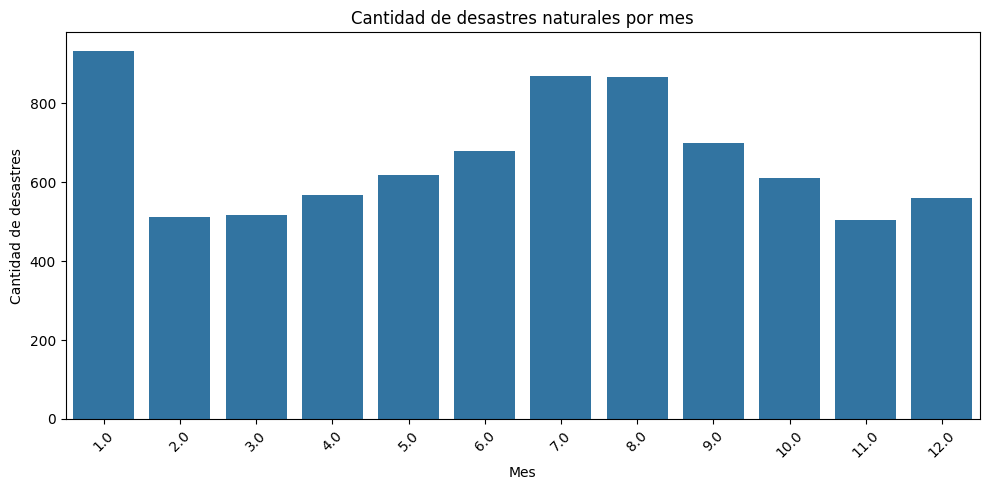
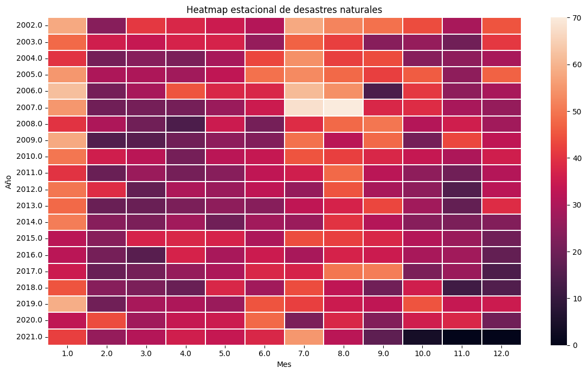
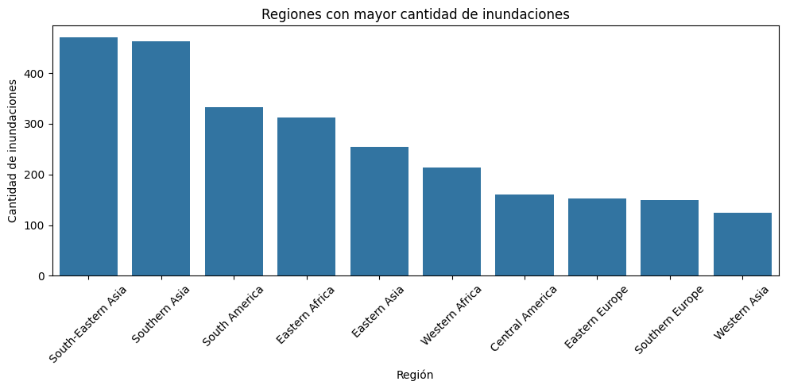
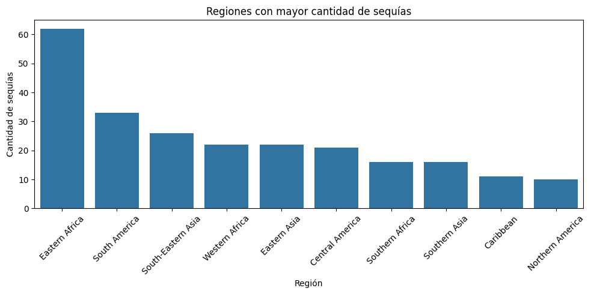
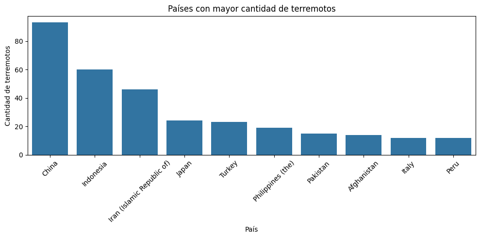
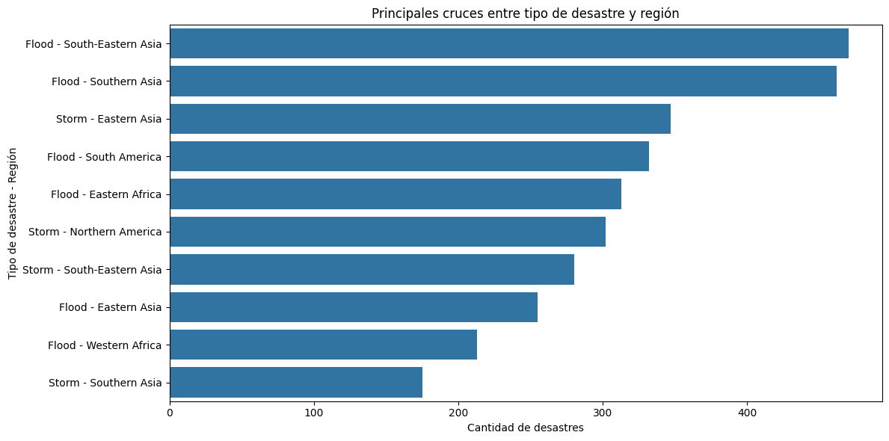
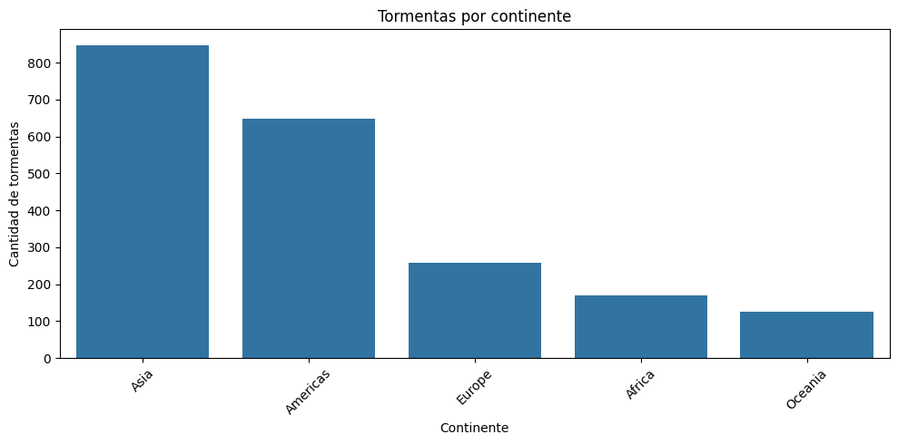

# Proyecto ETL - Análisis de Desastres Naturales 1970-2021

## Descripción del proyecto

Este proyecto desarrolla un proceso ETL modular aplicado al dataset de desastres naturales entre 1970 y 2021. El objetivo principal es realizar un análisis exploratorio de datos para identificar patrones temporales, estacionales y geográficos en la ocurrencia de distintos tipos de desastres naturales.

El trabajo se organiza en tres etapas principales:

- **Extract:** carga y validación inicial del dataset.
- **Transform:** limpieza, creación de variables temporales y generación de tablas analíticas.
- **Load:** exportación de tablas resumen y generación de visualizaciones.

---

## Estructura del proyecto

```text
proyecto_desastres_naturales/
├── data/
│   └── 1970-2021_DISASTERS.xlsx - emdat data.csv
├── extract/
│   └── extract.py
├── transform/
│   └── transform.py
├── load/
│   └── load.py
├── outputs/
│   ├── graficos/
│   └── reportes/
├── main.py
└── README.md
```

La carpeta `outputs/graficos/` contiene las visualizaciones generadas en formato PNG.

La carpeta `outputs/reportes/` contiene tablas resumen exportadas en formato CSV. Estos archivos no son informes escritos, sino salidas tabulares generadas por el proceso ETL.

---

## Dataset utilizado

El dataset contiene registros de desastres naturales ocurridos entre 1970 y 2021.

Algunas de las variables principales utilizadas fueron:

- `Year`
- `Disaster Type`
- `Disaster Subtype`
- `Country`
- `Region`
- `Continent`
- `Start Year`
- `Start Month`
- `Total Deaths`
- `Total Affected`
- `Total Damages ('000 US$)`

---

## Instalación de dependencias

Para ejecutar el proyecto, instalar las librerías necesarias:

```bash
pip install pandas numpy matplotlib seaborn openpyxl
```

---

## Ejecución del proyecto

Desde la carpeta principal del proyecto, ejecutar:

```bash
python main.py
```

Al finalizar la ejecución, se generan automáticamente las carpetas:

```text
outputs/graficos/
outputs/reportes/
```

---

# Desarrollo del proceso ETL

## 1. Módulo Extract

El módulo `extract.py` se encarga de la extracción de datos.

Sus principales funciones son:

- Leer el archivo CSV con Pandas.
- Validar que el archivo exista.
- Verificar que el DataFrame no esté vacío.
- Mostrar una exploración inicial del dataset:
  - cantidad de filas y columnas,
  - nombres de columnas,
  - tipos de datos,
  - valores nulos.

Esta etapa no realiza transformaciones ni gráficos. Su responsabilidad es únicamente cargar y validar los datos.

---

## 2. Módulo Transform

El módulo `transform.py` realiza la preparación de los datos para el análisis.

### Creación de columna temporal

Se unificaron las columnas `Start Year` y `Start Month` en una nueva columna llamada `fecha`, con formato `datetime64`.

A partir de esta columna se generaron variables auxiliares:

- `year`
- `month`
- `month_name`

Estas variables permiten analizar la evolución anual y mensual de los desastres.

### Filtrado temporal

Se creó un filtro para analizar las últimas dos décadas disponibles del dataset. Esto permite comparar la tendencia reciente con el comportamiento histórico completo.

### Limpieza de variables categóricas

Se depuraron columnas como:

- `Disaster Type`
- `Disaster Subtype`
- `Country`
- `Region`
- `Continent`

La limpieza incluyó:

- imputación de valores faltantes con `"Unknown"`,
- conversión a texto,
- eliminación de espacios innecesarios,
- estandarización básica de valores.

### Tablas analíticas generadas

Se generaron tablas resumen para:

- desastres por año,
- desastres por mes,
- matriz año-mes para heatmap estacional,
- cruces entre tipo de desastre y región,
- terremotos por país,
- inundaciones por región,
- sequías por región,
- tormentas por continente,
- incendios forestales por región y año.

---

## 3. Módulo Load

El módulo `load.py` se encarga de generar y guardar los resultados finales.

Sus principales funciones son:

- Crear gráficos en formato PNG.
- Exportar tablas resumen en formato CSV.
- Crear automáticamente las carpetas de salida si no existen.

Las salidas se guardan en:

```text
outputs/graficos/
outputs/reportes/
```

---

# Análisis de resultados

## 1. Cantidad de desastres naturales por año - Dataset completo

El gráfico del dataset completo muestra un crecimiento importante en la cantidad de desastres registrados desde 1970 hasta fines de la década de 1990. El punto máximo se observa alrededor del período 1999-2001.

Luego de ese período, la serie muestra una etapa de mayor estabilidad y una tendencia descendente moderada hacia los años más recientes.

Sin embargo, esta tendencia debe interpretarse con cautela. El gráfico representa desastres registrados en el dataset, no necesariamente la totalidad real de eventos ocurridos. La evolución puede estar afectada por cambios en la calidad del registro, criterios metodológicos, disponibilidad de datos o subregistro en algunos períodos.


---

## 2. Cantidad de desastres naturales por año - Últimas dos décadas

Al observar solo las últimas dos décadas, se aprecia una tendencia general descendente, aunque con varios picos intermedios.

Se destacan aumentos puntuales en años como 2005, 2010, 2015 y 2019. Esto indica que, aunque la tendencia general parece bajar, la ocurrencia anual de desastres sigue mostrando alta variabilidad.

La caída en 2021 debe analizarse con prudencia, ya que podría estar influida por carga incompleta de datos o diferencias en los registros disponibles.


---

## 3. Cantidad de desastres naturales por mes

El gráfico mensual permite observar posibles patrones estacionales.

Los meses con mayor cantidad de desastres registrados son enero, julio y agosto. En cambio, febrero y noviembre presentan valores más bajos.

Esto sugiere que la ocurrencia de desastres naturales no se distribuye de manera completamente uniforme durante el año. Puede existir una relación con fenómenos climáticos estacionales, como temporadas de lluvias, tormentas, ciclones, sequías o inundaciones.


---

## 4. Heatmap estacional año-mes

El heatmap muestra la distribución mensual de desastres por año durante las últimas dos décadas.

Se observan concentraciones más intensas en ciertos meses y años específicos, especialmente en enero y en algunos meses de mitad de año. Esto refuerza la idea de que existen patrones estacionales, aunque no completamente uniformes.

También se observa que algunos años presentan mayor intensidad general que otros, lo cual puede estar vinculado a eventos climáticos extremos o a variaciones en el registro de datos.


---

## 5. Regiones con mayor cantidad de inundaciones

Las regiones con mayor cantidad de inundaciones son:

- South-Eastern Asia
- Southern Asia
- South America
- Eastern Africa
- Eastern Asia

El predominio de regiones asiáticas es consistente con zonas altamente expuestas a lluvias monzónicas, ciclones, crecidas de ríos y alta densidad poblacional en áreas vulnerables.

Este cruce permite identificar regiones donde las inundaciones representan un problema recurrente y relevante.


---

## 6. Regiones con mayor cantidad de sequías

Eastern Africa aparece como la región con mayor cantidad de sequías registradas, con una diferencia importante respecto al resto.

También aparecen regiones como:

- South America
- South-Eastern Asia
- Western Africa
- Eastern Asia

Este resultado muestra que las sequías tienen una distribución geográfica marcada y afectan especialmente a regiones con vulnerabilidad climática, agrícola y socioeconómica.


---

## 7. Países con mayor cantidad de terremotos

Los países con mayor cantidad de terremotos registrados son:

- China
- Indonesia
- Iran
- Japan
- Turkey
- Philippines
- Pakistan
- Afghanistan
- Italy
- Peru

Este resultado es coherente con países ubicados en zonas de alta actividad sísmica, como el Cinturón de Fuego del Pacífico y otras zonas de contacto entre placas tectónicas.


---

## 8. Principales cruces entre tipo de desastre y región

Los cruces más relevantes muestran una fuerte presencia de inundaciones en regiones asiáticas:

- Flood - South-Eastern Asia
- Flood - Southern Asia
- Storm - Eastern Asia
- Flood - South America
- Flood - Eastern Africa

Esto indica que las inundaciones son uno de los tipos de desastre más frecuentes en el dataset y que su distribución está muy concentrada en determinadas regiones.

También se observa una presencia importante de tormentas en Eastern Asia, Northern America y South-Eastern Asia.


---

## 9. Tormentas por continente

Asia y Americas concentran la mayor cantidad de tormentas registradas.

Europa, África y Oceanía presentan cantidades menores en comparación.

Este patrón puede estar relacionado con la exposición geográfica de ciertas regiones a ciclones tropicales, huracanes, tifones y tormentas severas.


---

# Conclusiones generales

El análisis permite identificar patrones temporales, estacionales y geográficos relevantes en la ocurrencia de desastres naturales.

A nivel temporal, el dataset completo muestra un crecimiento fuerte desde 1970 hasta fines de los años 90, seguido por una etapa de estabilización y posterior descenso relativo. En las últimas dos décadas, la tendencia parece decreciente, aunque con picos importantes en años específicos.

A nivel estacional, se observa que algunos meses concentran mayor cantidad de eventos, especialmente enero y los meses de mitad de año. Esto sugiere que la ocurrencia de desastres puede estar influida por dinámicas climáticas estacionales.

A nivel geográfico, Asia aparece como una región altamente expuesta a distintos tipos de desastres, especialmente inundaciones, tormentas y terremotos. Eastern Africa se destaca particularmente en el análisis de sequías.

En términos analíticos, los resultados muestran que los desastres naturales no se distribuyen de forma aleatoria ni homogénea. Existen patrones temporales, regionales y por tipo de desastre que pueden ser explorados mediante técnicas de análisis de datos.

No obstante, los resultados deben interpretarse con cautela, ya que el análisis depende de los eventos registrados en el dataset. Cambios en los criterios de registro, subregistro o diferencias metodológicas pueden influir en las tendencias observadas.

---

# Posibles mejoras futuras

Algunas mejoras posibles para ampliar el análisis serían:

- Incorporar análisis de muertes, afectados y daños económicos.
- Calcular medias móviles para suavizar tendencias temporales.
- Comparar cantidad de eventos con severidad de impacto.
- Analizar cada tipo de desastre por separado.
- Incorporar mapas geográficos.
- Crear un dashboard interactivo en Power BI o Streamlit.
- Aplicar modelos de series temporales para estudiar tendencia y estacionalidad.

---

# Autor

Trabajo práctico desarrollado para la materia Procesamiento de Datos.

Autor: Moisés Lobayza